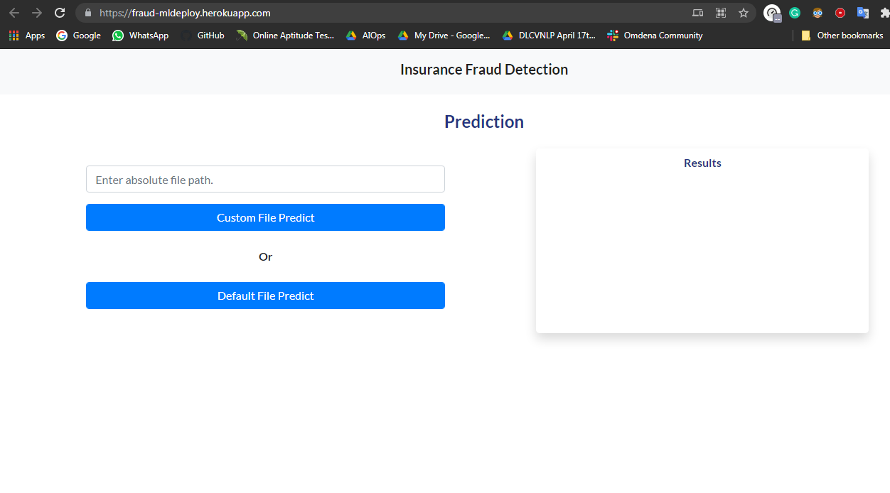
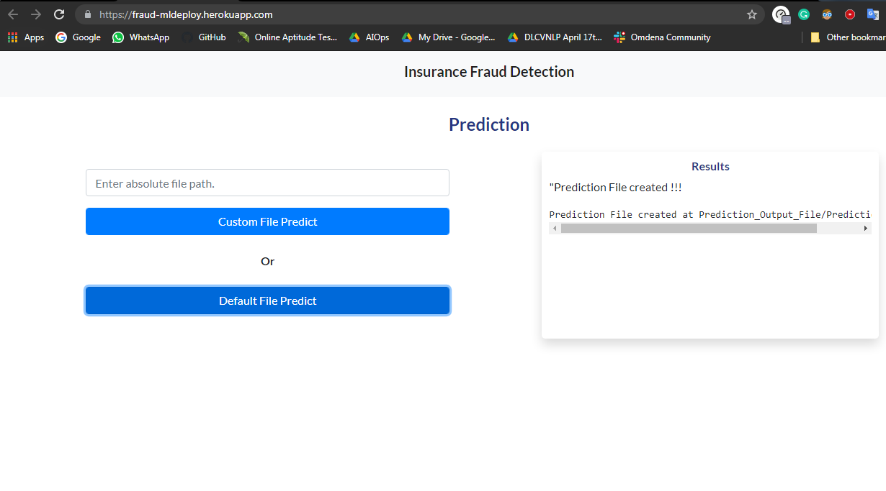
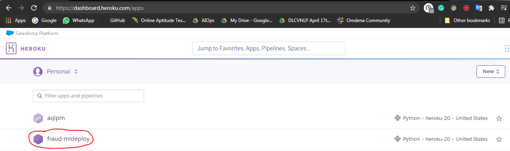

# Insurance Fraud-Detection-using-Machine-Learning

## Demo

Link to the Project - https://fraud-mldeploy.herokuapp.com/



Prediction saved to a particular folder - 



## About this Project

This project is based on **Insurance Domain**.

Imagine a situation where an Insurance Company is receiving **tons of request** from its cutomer for their **claims**. In such situation they dont have much time to go through each and every application for checking if its a **false claim or not**.

Main focus is to reduce the workload by **20-30%** and focus on customers or other queries.

Using power of Machine Learning algorithms following project titled **Insurance Fraud-Detection-using-Machine-Learning** was able to be sucessfull. 

## Project Pipeline


## Technologies Used


[](https://flask.palletsprojects.com/en/1.1.x/) [](https://gunicorn.org) [](https://scikit-learn.org/stable/) 

[](https://www.sqlite.org/index.html)


## How to Get Started

You can also use this project in your system by following thses simple steps -:

### Clone this Repo - 

```
git clone https://github.com/Rishav-hub/Insurance-Fraud-Detection-using-Machine-Learning.git

```

### Install the requirements - 

```
pip install -r requirements.txt

```

### Run the main.py file

```
python main.py
```

### You are done and Good to go

## Deployment

This project is deployed in Heroku Cloud




## Future work
- More functionality can be added.
- Imporving the user interface and frontend.
